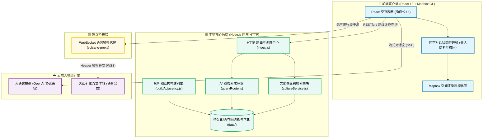

# 京轨 (JingRail.AI) —— 在地铁上读懂北京


<p align="center">
   [<a href="">试一试</a>] [<a href="https://github.com/loveustars/dsproject/blob/main/docs/README.en.md">English</a>] [<a href="https://github.com/loveustars/dsproject/blob/main/README.md">简体中文</a>] [<a href="https://github.com/loveustars/dsproject/blob/main/docs/README.ja.md">日本語</a>] [<a href="https://github.com/loveustars/dsproject/blob/main/docs/README.fr.md">Français</a>] [<a href="https://github.com/loveustars/dsproject/blob/main/docs/README.ko-KR.md">한국어</a>]
</p>

京轨 (JingRail.AI) 是一款专为到访北京的国内外游客打造的智能化地铁文旅导游系统。它不仅是一个地铁寻路工具，更是结合了 LLM 大模型推理、智能体 Agent、A* 最短路径搜索以及实时流式语音合成（TTS）的沉浸式文化传播平台，让每一站地铁成为体验中华文化的窗口。

<div align="center">
  <video src="https://github.com/loveustars/dsproject/tree/main/docs/zh-CN.mp4" controls width="80%"></video>
  <br/>
  <em>项目演示视频</em>
</div>

---

## 核心特性

- **高度定制的空间地理可视化**  
  基于 Mapbox GL 引擎构建，实现了对北京地铁网（路线、站点）的动态图层渲染、精确着色以及 A* 算法路线的实时高亮。通过重整采集数据，实现地铁线路在真实地理环境中的完美贴合。
  
- **流式智能导览与多轮对话系统**  
  集成了 OpenAI 协议兼容的大语言模型交互接口。采用 SSE 读写流技术，能够像打字机一样呈现文化百科内容组合解答，并附有严谨的局部状态管理栈体系（支持会话随时撤回与图层状态的时光倒流）。
  
- **零延迟“同传”级别的流式语音合成**  
  高度集成了火山引擎 WebSocket TTS。采用前端自定义 Node 代理鉴权和内部串行播放队列防重叠算法，实现了业内前沿的“前置无声流唤醒”机制，彻底解决了冷启动吞字问题，实现极致流畅的同频伴读。
  
- **多语种国际化与全端适配**  
  内建灵活的国际化映射及多视角 Prompt 控制，让应用即刻完成中、英文版切换。利用先进的 CSS 媒体查询设计提供完美适配 PC 和移动设备浏览器的响应式体验（Responsive Layout），在任何设备上都能获得原生级的手势反馈。

---

## 架构与技术栈

- **核心前端架构**：React 18 + TypeScript + Vite
- **地理信息与渲染引擎**：Mapbox GL / react-map-gl + 定制 GeoJSON 数据流
- **状态管理**：React Context/Hooks 历史状态快照管理栈模型
- **交互与样式**：标准原生 CSS / Flexbox / 移动端触摸手势适配
- **音频交互桥接**：Node.js 运行时 WebSockets 握手代理 (`volcano-tts-proxy.ts`)

### 系统架构图



---

## 快速启动指南

### 1. 启动前端工作空间

```bash
cd Frontend/metro-app
npm install
npm run dev
```

### 2. 启动 TTS 语音通信代理基站

> [!NOTE]
> 现代浏览器由于安全限制不允许 WebSocket 握手时携带自定义 Header，导致无法通过火山引擎流式语音直连鉴权。在此场景下，必须开启此代理层协助转发。

```bash
# 在 Frontend/metro-app 目录下，新开一个终端窗口运行：
npx tsx volcano-tts-proxy.ts
```

> [!TIP]
> 开启代理后，前往应用设置中，将「WebSocket 代理地址」默认填入 `ws://localhost:8765` 即可顺利激活语音服务。

### 3. 启动后端辅助数据服务（可选启动项）

```bash
cd ../../Backend
npm install
npm run dev
```

---

## 移动端局域网测试（内网热部署）

如果想在个人的手机上体验完全体的响应式移动版交互效果（确保计算机与手机在同个 Wi-Fi 中）：

1. 为前端启动脚本追加开放 Host 主机权限参数：
   ```bash
   npm run dev -- --host
   ```
2. 控制台中会暴露您的本机局域网 IP（比如 `http://192.168.1.100:5173`），手机自带浏览器访问此地址。

> [!WARNING]
> **特别注意：** 使用手机版访问时，请在左下角设置中，把 TTS WebSocket 连接和后端 API 接口地址从 `localhost` 同步替换为上述控制台打印的真实局域网 IP，否则将导致网络请求跨域或连接目标拒绝。

---

## 图形化配置面板

<details>
<summary>展开查看详细的系统面板配置指引</summary>

本系统摒弃了硬编码式联调，提供一站式的运行时设置页。部署成型并启动环境后，点击左下角的**设置管理**图标，随时可进行以下调整：

1. **核心模型设定**：热修改对接的大语言模型调用入口 URL 节点和验证密钥（原生解耦支持任何符合 OpenAI 规范的私有部署大模型）。
2. **播报合成控制**：支持更改火山流式体验 TTS 服务的令牌组合，并能动态改变发声人音色和音频流语速设定。
3. **地图空间密钥**：为加载复杂的瓦片图层需要填入您的专用 **Mapbox Token**，以及定义右侧轨道路线调度请求的目标服务器端口。

</details>

---

# 项目演示

## 移动端版本


## 撤回与状态恢复


## 知识图谱


---

> 京轨，穿梭数字世界，传递有温度的中国文化。
