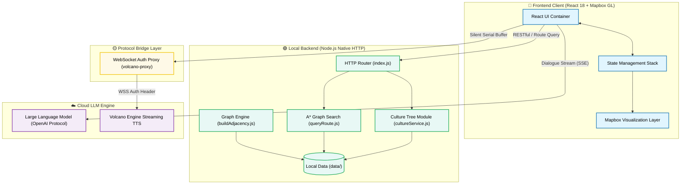
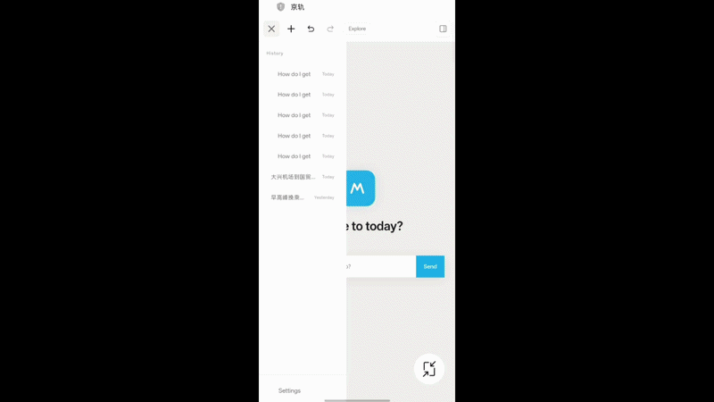
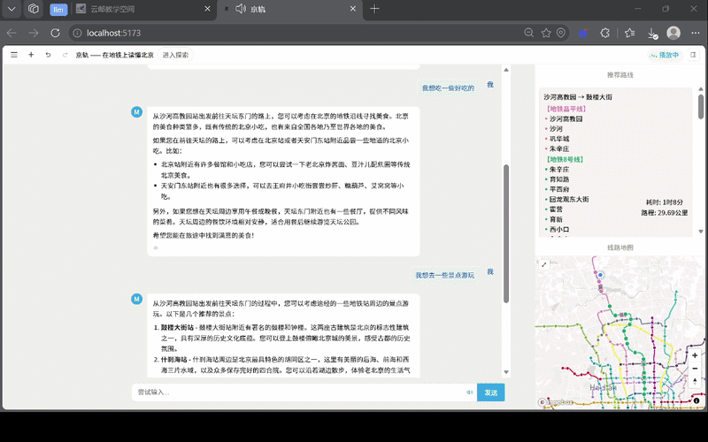
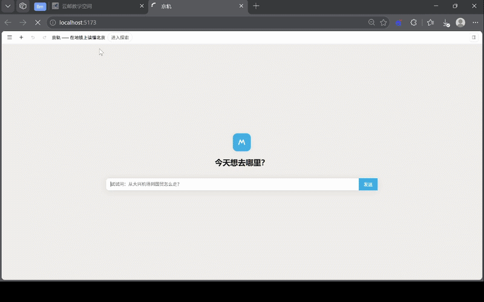

# JingRail.AI — Understand Beijing on the Metro

<p align="center">
   [<a href="">Try it out</a>] [<a href="https://github.com/loveustars/dsproject/blob/main/docs/README.en.md">English</a>] [<a href="https://github.com/loveustars/dsproject/blob/main/README.md">简体中文</a>] [<a href="https://github.com/loveustars/dsproject/blob/main/docs/README.ja.md">日本語</a>] [<a href="https://github.com/loveustars/dsproject/blob/main/docs/README.fr.md">Français</a>] [<a href="https://github.com/loveustars/dsproject/blob/main/docs/README.ko-KR.md">한국어</a>]
</p>

JingRail.AI is an intelligent subway cultural tourism guide system specially designed for domestic and foreign tourists visiting Beijing. It is not only a subway wayfinding tool, but also an immersive cultural dissemination platform combining LLM inference, Agent technology, A* shortest path search, and real-time streaming Text-To-Speech (TTS), making every subway station a window to experience Chinese culture.

<div align="center">
  <video src="https://www.bilibili.com/video/BV13h5m6tEt3" controls width="80%"></video>
  <br/>
</div>
---

## Core Features

- **Highly Customized Spatial Geographic Visualization**  
  Built on the Mapbox GL engine, it achieves dynamic layer rendering, precise coloring, and real-time highlighting of A* algorithm routes for the Beijing subway network.
  
- **Streaming Intelligent Guide & Multi-round Dialogue System**  
  Integrates an LLM interactive interface compatible with the OpenAI protocol. Uses Server-Sent Events (SSE) to present cultural encyclopedia combinations like a typewriter, with a strict local state management stack.
  
- **Zero-latency "Simultaneous Interpretation" Level Streaming TTS**  
  Deeply integrates Volcano Engine WebSocket TTS. Uses a frontend custom Node proxy for authentication and an internal serial playback queue to prevent voice overlap.
  
- **Multilingual Internationalization & Cross-platform Adaptation**  
  Built-in flexible international mapping and multi-perspective Prompt control for immediate language switching. Utilizes advanced CSS media queries for a responsive layout.

---

## Architecture & Tech Stack

- **Frontend Architecture**: React 18 + TypeScript + Vite
- **Geographic Info Engine**: Mapbox GL / react-map-gl + Custom GeoJSON
- **State Management**: React Context/Hooks Historical State Snapshot Stack
- **Audio Bridge**: Node.js Runtime WebSockets Proxy (`volcano-tts-proxy.ts`)

### System Architecture Diagram



---

## Quick Start Guide

### 1. Start Frontend Workspace

```bash
cd Frontend/metro-app
npm install
npm run dev
```

### 2. Start TTS Proxy Station

> [!NOTE]
> Modern browsers restrict custom headers in WebSocket handshakes. You must run this proxy layer to forward requests to the Volcano Engine TTS.

```bash
npx tsx volcano-tts-proxy.ts
```

> [!TIP]
> After starting, go to the App Settings and enter `ws://localhost:8765` as the WebSocket Proxy Address.

### 3. Start Backend Service (Optional)

```bash
cd ../../Backend
npm install
npm run dev
```

---

# Demos

## Mobile version



## Withdrawal & recovery


## Knowledge graph


---

> JingRail AI, traversing the digital world, spreading Chinese culture with warmth.