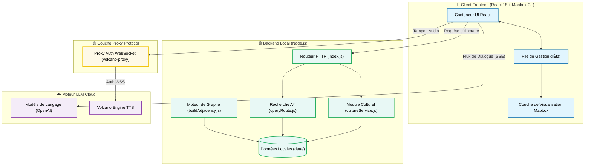

# JingRail.AI — Comprendre Pékin dans le métro

<p align="center">
   [<a href="">Essayer</a>] [<a href="https://github.com/loveustars/dsproject/blob/main/docs/README.en.md">English</a>] [<a href="https://github.com/loveustars/dsproject/blob/main/README.md">简体中文</a>] [<a href="https://github.com/loveustars/dsproject/blob/main/docs/README.ja.md">日本語</a>] [<a href="https://github.com/loveustars/dsproject/blob/main/docs/README.fr.md">Français</a>] [<a href="https://github.com/loveustars/dsproject/blob/main/docs/README.ko-KR.md">한국어</a>]
</p>

JingRail.AI est un système de guide touristique culturel intelligent du métro spécialement conçu pour les touristes nationaux et étrangers visitant Pékin. Ce n'est pas seulement un outil de recherche d'itinéraire pour le métro, mais aussi une plateforme de diffusion culturelle immersive.

<div align="center">
  <video src="./docs/en.mp4" controls width="80%"></video>
  <br/>
</div>

---

## Fonctionnalités Principales

- **Visualisation géographique spatiale hautement personnalisée**  
  Basé sur le moteur Mapbox GL, il réalise un rendu de couches dynamiques, une coloration précise et une mise en évidence en temps réel des itinéraires de l'algorithme A* pour le réseau du métro de Pékin.
  
- **Guide intelligent en streaming et système de dialogue**  
  Intègre une interface interactive LLM compatible avec le protocole OpenAI. Utilise la technologie SSE pour présenter des réponses encyclopédiques culturelles.
  
- **Synthèse vocale (TTS) en streaming sans délai**  
  Intègre profondément le WebSocket TTS de Volcano Engine.
  
- **Internationalisation multilingue et adaptation complète**  
  Mappages internationaux flexibles et conception CSS adaptative pour PC et mobile.

---

## Architecture et Technologies

- **Architecture Frontend** : React 18 + TypeScript + Vite
- **Moteur géographique** : Mapbox GL / react-map-gl
- **Gestion d'état** : React Context/Hooks (Pile d'historique)
- **Pont audio** : Proxy WebSockets Node.js (`volcano-tts-proxy.ts`)

### Diagramme d'Architecture



---

## Démarrage Rapide

### 1. Démarrer le Frontend

```bash
cd Frontend/metro-app
npm install
npm run dev
```

### 2. Démarrer le Proxy TTS

> [!NOTE]
> Requis pour la synthèse vocale en raison des restrictions de sécurité du navigateur pour WebSocket.

```bash
npx tsx volcano-tts-proxy.ts
```

### 3. Démarrer le Service Backend (Optionnel)

```bash
cd ../../Backend
npm install
npm run dev
```

---

# Démos

## Version mobile


## Annulation et récupération


## Graphe de connaissances


---

> JingRail, traverser le monde numérique, transmettre la culture chinoise avec chaleur.