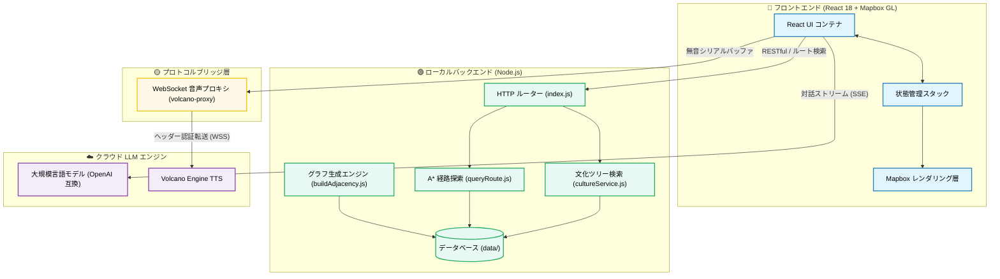

# 京軌 (JingRail.AI) —— 地下鉄で北京を読み解く

<p align="center">
   [<a href="">試してみる</a>] [<a href="https://github.com/loveustars/dsproject/blob/main/docs/README.en.md">English</a>] [<a href="https://github.com/loveustars/dsproject/blob/main/README.md">简体中文</a>] [<a href="https://github.com/loveustars/dsproject/blob/main/docs/README.ja.md">日本語</a>] [<a href="https://github.com/loveustars/dsproject/blob/main/docs/README.fr.md">Français</a>] [<a href="https://github.com/loveustars/dsproject/blob/main/docs/README.ko-KR.md">한국어</a>]
</p>

京軌 (JingRail.AI) は、北京を訪れる国内外の観光客のために特別に作られた、インテリジェントな地下鉄文化観光ガイドシステムです。これは単なる地下鉄の経路探索ツールではなく、LLM推論、エージェント、A*最適経路探索、そしてリアルタイムストリーミング音声合成(TTS)を組み合わせた没入型の文化発信プラットフォームです。

<div align="center">
  <video src="./docs/en.mp4" controls width="80%"></video>
  <br/>
</div>

---

## 主要な特徴

- **高度にカスタマイズされた空間地理ビジュアライゼーション**  
  Mapbox GLエンジンをベースに構築され、北京の地下鉄ネットワークの動的なレイヤーレンダリング、正確なカラーリング、A*アルゴリズムによるルートのリアルタイムハイライトを実現します。
  
- **ストリーミングインテリジェントガイドとマルチターン対話システム**  
  OpenAIプロトコルと互換性のある大規模言語モデルのインターフェースを統合。SSE読み書きストリーム技術を採用し、タイプライターのように文化情報を表示します。
  
- **ゼロ遅延「同時通訳」レベルのストリーミング音声合成**  
  Volcano EngineのWebSocket TTSを深く統合。フロントエンドのカスタムNodeプロキシ認証と内部シリアル再生キューの重複防止アルゴリズムを使用しています。
  
- **多言語国際化と全端末対応**  
  柔軟な国際化マッピングと複数のプロンプト制御を内蔵。高度なCSSメディアクエリを使用し、PCおよびモバイルのブラウザに最適なレスポンシブデザインを提供します。

---

## アーキテクチャと技術スタック

- **コアフロントエンド**：React 18 + TypeScript + Vite
- **地図情報・レンダリング**：Mapbox GL / react-map-gl + カスタム GeoJSON
- **状態管理**：React Context/Hooks 履歴状態スナップショットスタック
- **音声ブリッジ**：Node.js ランタイム WebSocket プロキシ (`volcano-tts-proxy.ts`)

### システムアーキテクチャ図



---

## クイックスタート

### 1. フロントエンドの起動

```bash
cd Frontend/metro-app
npm install
npm run dev
```

### 2. TTS代理サーバーの起動

> [!NOTE]
> 最新のブラウザはWebSocket通信時のカスタムヘッダーを制限しているため、Volcano Engineの音声サービスに接続するにはこのプロキシが必要です。

```bash
npx tsx volcano-tts-proxy.ts
```

> [!TIP]
> アプリの設定で「WebSocket プロキシアドレス」を `ws://localhost:8765` に設定してください。

### 3. バックエンドサービスの起動（オプション）

```bash
cd ../../Backend
npm install
npm run dev
```

---

# デモ

## モバイル版

<div align="center">
  <video src="./docs/mobile.mp4" controls width="80%"></video>
  <br/>
</div>

## 取り消しと復元
<div align="center">
  <video src="./docs/wr.mp4" controls width="80%"></video>
  <br/>
</div>

## ナレッジグラフ
<div align="center">
  <video src="./docs/graph.mp4" controls width="80%"></video>
  <br/>
</div>

---

> 京軌、デジタル世界を駆け抜け、温もりある中国文化を伝える。