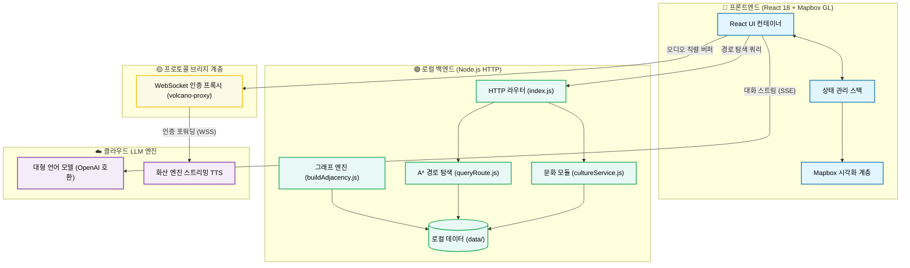

# 징루이 (JingRail.AI) —— 지하철에서 베이징을 이해하다

<p align="center">
   [<a href="">체험하기</a>] [<a href="https://github.com/loveustars/dsproject/blob/main/docs/README.en.md">English</a>] [<a href="https://github.com/loveustars/dsproject/blob/main/README.md">简体中文</a>] [<a href="https://github.com/loveustars/dsproject/blob/main/docs/README.ja.md">日本語</a>] [<a href="https://github.com/loveustars/dsproject/blob/main/docs/README.fr.md">Français</a>] [<a href="https://github.com/loveustars/dsproject/blob/main/docs/README.ko-KR.md">한국어</a>]
</p>

징루이(JingRail.AI)는 베이징을 방문하는 국내외 관광객을 위해 특별히 제작된 지능형 지하철 문화 관광 안내 시스템입니다. 단순한 지하철 길찾기 도구가 아니라, LLM 대형 모델 추론, 에이전트, A* 최단 경로 탐색, 실시간 스트리밍 음성 합성(TTS)이 결합된 몰입형 문화 전파 플랫폼입니다.


<div align="center">
  <video src="./docs/en.mp4" controls width="80%"></video>
  <br/>
</div>
---

## 핵심 기능

- **고도로 맞춤화된 공간 지리 시각화**  
  Mapbox GL 엔진을 기반으로, 베이징 지하철망의 동적 레이어 렌더링, 정확한 색상 지정, A* 알고리즘 경로의 실시간 하이라이트 기능을 구현했습니다.
  
- **스트리밍 지능형 안내 및 다중 대화 시스템**  
  OpenAI 프로ト콜과 호환되는 대형 언어 모델 인터페이스를 통합했습니다. SSE 기술을 사용하여 타자기처럼 백과사전 콘텐츠를 제공합니다.
  
- **제로 지연 "동시통역" 수준의 스트리밍 음성 합성**  
  Volcano Engine WebSocket TTS를 통합했습니다. 프론트엔드 맞춤형 Node 프록시 인증 및 내부 직렬 재생 대기열 알고리즘을 사용합니다.
  
- **다국어 국제화 및 풀 플랫폼 지원**  
  유연한 다국어 및 고급 CSS 미디어 쿼리를 사용하여 완벽한 반응형 환경을 제공합니다.

---

## 아키텍처 및 기술 스택

- **프론트엔드 아키텍처**: React 18 + TypeScript + Vite
- **지리 공간 엔진**: Mapbox GL / react-map-gl
- **상태 관리**: React Context/Hooks 역사 상태 스냅샷 스택 모델
- **오디오 브리지**: Node.js 런타임 WebSockets 프록시 (`volcano-tts-proxy.ts`)

### 시스템 아키텍처 다이어그램



---

## 빠른 시작 가이드

### 1. 프론트엔드 시작

```bash
cd Frontend/metro-app
npm install
npm run dev
```

### 2. TTS 음성 프록시 시작

> [!NOTE]
> 브라우저 보안 제한으로 인해 화산 엔진 스트리밍 음성에 직접 연결할 수 없으므로, 이 프록시 계층을 실행해야 합니다.

```bash
npx tsx volcano-tts-proxy.ts
```

### 3. 백엔드 지원 서비스 시작 (선택 사항)

```bash
cd ../../Backend
npm install
npm run dev
```

---

# 데모

## 모바일 버전


## 실행 취소 및 복구


## 지식 그래프


---

> 징루이, 디지털 세계를 넘나들며 따뜻한 중국 문화를 전합니다.